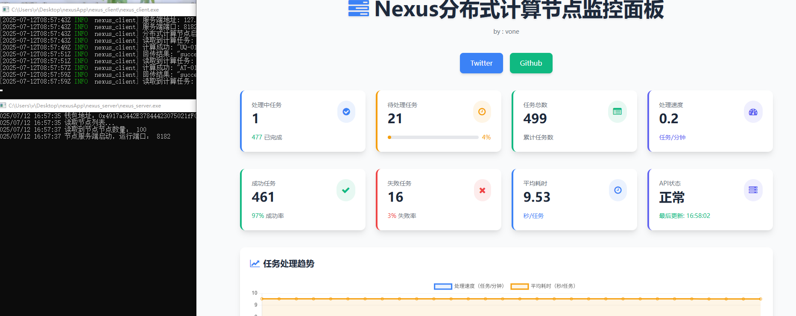

Nexus 节点工具


Nexus 是一套包含服务端和客户端的节点工具，支持跨系统部署，目前已提供 Linux 和 Windows 版本，Mac 版本将在后续更新中支持。


工具文件说明


| 系统&#xA;      | 服务端程序&#xA;         | 客户端程序&#xA;         |
| ------------ | ------------------ | ------------------ |
| Windows&#xA; | `nexus_server.exe` | `nexus_client.exe` |
| Linux&#xA;   | `nexus_server`     | `nexus_client`     |

配置步骤


### 1. 服务端配置（`nexus_server.txt`）&#xA;

服务端配置文件需填写以下信息：


```
address: 0x4917a3442E37844423075021fF02e6b4Ea111e6f


port: 8182


queue: 20


worker: 5
```


*   **address**：填写你的钱包地址（替换示例中的默认地址）。


*   **port**：端口号，需与客户端配置的 `port` 保持一致（示例为 8182，可自定义）。


*   **queue**：取值为「计划开启的客户端数量 × 3」（示例中 5 个客户端对应 20，可根据实际数量调整）。


*   **worker**：填写计划开启的客户端总数量（示例为 5，即同时运行 5 个客户端）。


### 2. 客户端配置（`nexus_client.txt`）&#xA;

客户端配置文件需填写以下信息：


```
host: 127.0.0.1


port: 8182
```


*   **host**：服务端的 IP 地址，根据部署场景选择：


    *   服务端在**公网服务器**：填写公网 IP。


    *   服务端与客户端在**同一台电脑**：填写 `127.0.0.1`。


    *   服务端与客户端在**局域网内不同电脑**：填写服务端的局域网 IP（如 `192.168.1.100`）。


*   **port**：端口号，需与服务端配置的 `port` 完全一致（示例为 8182）。


### 3. 多开说明&#xA;

若需同时运行多个客户端（多钱包场景），可通过以下方式实现：


*   为每个客户端配置独立的 `nexus_client.txt`（端口号需与对应服务端保持一致，但不同服务端可使用不同端口）。
*   每个服务端程序对应一组独立的端口和配置，通过不同端口实现多开。


运行说明


1.  先启动服务端程序（根据系统选择对应文件）。
   -> win系统直接双击exe，linux输入启动命令 ./nexus_server，注意，配置文件nexus_server.txt需要和程序一个目录

2.  再启动客户端程序。
   -> win系统直接双击exe，linux输入启动命令 ./nexus_client，注意，配置文件nexus_client.txt需要和程序一个目录

3.  服务端和客户端可跨系统部署（例如 Windows 服务端搭配 Linux 客户端）。


状态截图


程序运行状态示例：




注意事项


*   目前仅支持 Linux 和 Windows 系统，Mac 版本将在后续更新中提供。


*   端口号需确保在防火墙中开放，避免被拦截。


*   配置文件需与对应程序放在同一目录下，否则可能导致读取失败。


如有问题，欢迎提交 Issue 反馈！
